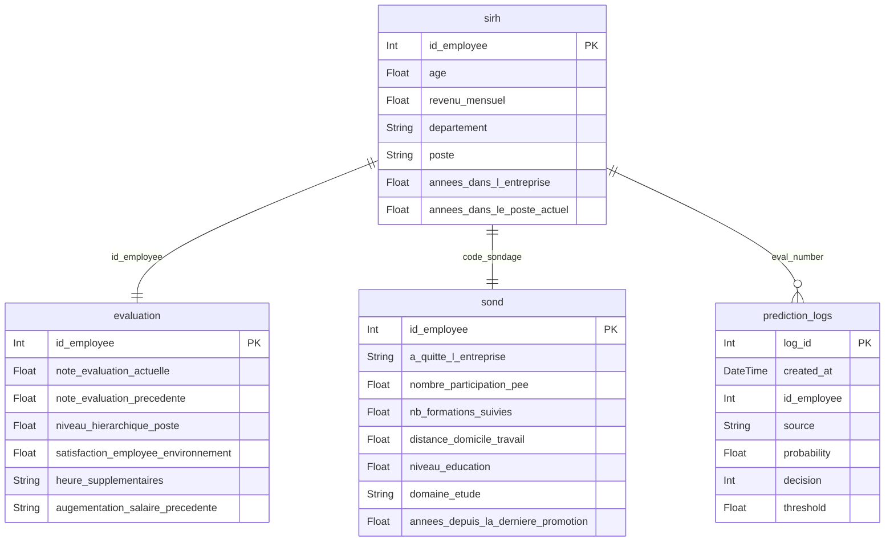

# Données attendues

L’interface Gradio expose trois modes d’entrée (Formulaire unitaire, Fichier CSV fusionné, fichiers non-mergés).  
Dans tous les cas, il faut fournir les colonnes « brutes » ci-dessous ; l’application se charge ensuite de recalculer toutes les features dérivées (ratios, moyennes de satisfaction, etc.).

## Champs numériques

| Colonne | Description | Format attendu |
| --- | --- | --- |
| `age` | Âge de l’employé | Entier ou décimal en années |
| `revenu_mensuel` | Salaire mensuel brut | Numérique, en euros |
| `annees_dans_l_entreprise` | Ancienneté totale | Nombre d’années (ex : 4.5) |
| `annees_dans_le_poste_actuel` | Ancienneté sur le poste actuel | Nombre d’années |
| `annees_depuis_la_derniere_promotion` | Temps depuis la dernière promotion | Nombre d’années |
| `distance_domicile_travail` | Distance domicile ↔ travail | Kilomètres |
| `nombre_participation_pee` | Participations au PEE | Entier |
| `nombre_experiences_precedentes` | Nombre d’expériences professionnelles antérieures | Entier |
| `note_evaluation_actuelle` | Dernière note d’évaluation | Score de 1 à 5 |
| `note_evaluation_precedente` | Note d’évaluation précédente | Score de 1 à 5 |
| `annee_experience_totale` | Expérience cumulée | Nombre d’années |
| `nb_formations_suivies` | Formations suivies | Entier |
| `nombre_employee_sous_responsabilite` | Nombre de collaborateurs supervisés | Entier |
| `augementation_salaire_precedente` | Dernière augmentation, exprimée en % | Valeur décimale ou pourcentage (ex : `5%`) |
| `satisfaction_employee_environnement` | Satisfaction vis-à-vis de l’environnement | Score de 1 (faible) à 5 (forte) |
| `satisfaction_employee_nature_travail` | Satisfaction vis-à-vis des missions | Score de 1 à 5 |
| `satisfaction_employee_equipe` | Satisfaction vis-à-vis de l’équipe | Score de 1 à 5 |
| `satisfaction_employee_equilibre_pro_perso` | Satisfaction équilibre pro/perso | Score de 1 à 5 |

## Champs catégoriels (listes déroulantes)

| Colonne | Valeurs proposées dans l’UI | Valeurs utilisées pour l’inférence |
| --- | --- | --- |
| `genre` | `Femme`, `Homme` | Converties vers `F` / `M` |
| `frequence_deplacement` | `Aucun`, `Occasionnel`, `Frequent` | Valeurs identiques |
| `statut_marital` | `Célibataire`, `Marié(e)`, `Divorcé(e)` | Valeurs identiques |
| `departement` | `Commercial`, `Consulting`, `Ressources Humaines` | Valeurs identiques |
| `poste` | `Cadre Commercial`, `Assistant de Direction`, `Consultant`, `Tech Lead`, `Manager`, `Senior Manager`, `Représentant Commercial`, `Directeur Technique`, `Ressources Humaines` | Valeurs identiques |
| `niveau_hierarchique_poste` | Saisie libre (ex : `Junior`, `Senior`, `Direction`) | Texte libre |
| `niveau_education` | Saisie libre (ex : `Licence`, `Master`, `Doctorat`) | Texte libre |
| `domaine_etude` | `Entrepreunariat`, `Infra & Cloud`, `Marketing`, `Ressources Humaines`, `Transformation Digitale` | Valeurs identiques |
| `heure_supplementaires` | `Oui`, `Non` | Valeurs identiques |

## Colonnes calculées automatiquement

Les ratios et moyennes suivants sont ajoutés côté application ; inutile de les fournir dans vos fichiers :

- `augmentation_par_revenu`
- `annee_sur_poste_par_experience`
- `nb_formation_par_experience`
- `score_moyen_satisfaction`
- `dern_promo_par_experience`
- `evolution_note`

Un exemple complet de fichier à importer est disponible dans `data/sample_employees.csv`.  
Il couvre les différents champs et peut servir de gabarit pour préparer vos propres jeux de données.

## Schéma PostgreSQL

La base PostgreSQL comprend quatre tables durables :

| Table | Description | Colonnes principales |
| --- | --- | --- |
| `sirh` | Données RH structurées (profil, poste, revenu). | `id_employee` (PK), `age`, `genre`, `revenu_mensuel`, `statut_marital`, `departement`, `poste`, `nombre_experiences_precedentes`, `annees_dans_l_entreprise`, `annees_dans_le_poste_actuel`, etc. |
| `evaluation` | Notes et informations d’évaluation annuelles. | `eval_number` (PK), `note_evaluation_actuelle`, `note_evaluation_precedente`, `niveau_hierarchique_poste`, `satisfaction_*`, `heure_supplementaires`, `augementation_salaire_precedente`. |
| `sond` | Résultats du sondage employés + cible d’attrition. | `code_sondage` (PK), `a_quitte_l_entreprise`, `nombre_participation_pee`, `nb_formations_suivies`, `distance_domicile_travail`, `niveau_education`, `domaine_etude`, `frequence_deplacement`, `annees_depuis_la_derniere_promotion`, etc. |
| `prediction_logs` | Journalisation des interactions entre utilisateurs et modèle ML. | `log_id` (PK), `created_at`, `id_employee`, `source` (form/table/csv/raw), `probability`, `decision`, `threshold`, `payload` (JSON de l’entrée). |

Les trois premières tables sont alimentées par le script `python -m scripts.init_db` à partir des CSV bruts (`paths.sirh`, `paths.evaluation`, `paths.sondage`).  
`prediction_logs` est auto-alimentée par `app.py` lors de chaque prédiction, ce qui permet de tracer les usages et de recalibrer le modèle.

> L’ensemble du pipeline (`dataset.py`, `app.py`, `scripts/init_db.py`) repose sur la même URL PostgreSQL (`database.url` dans `settings.yml`). Veillez à fournir un utilisateur disposant des droits `CREATE`, `INSERT` et `DROP` sur le schéma indiqué.
